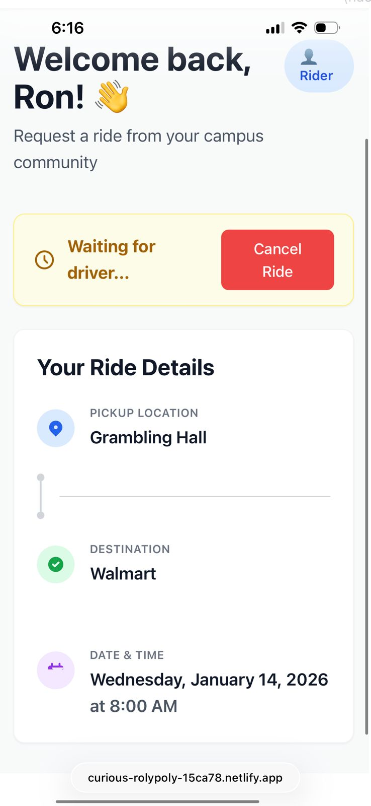
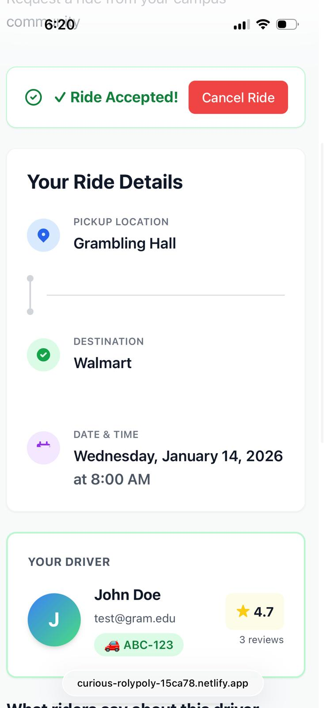

# QuadDash

**Campus Ride-Sharing Platform for HBCUs**

A web-based campus ride connector that enables verified students from the same university to connect for rides within their campus community.

**[Live Demo](https://curious-rolypoly-15ca78.netlify.app)** | **[API Documentation](https://colorstackwinterhack2025-quaddash.onrender.com/docs)**

---

## Table of Contents

- [Project Description](#project-description)
- [The Problem](#the-problem)
- [How QuadDash Solves It](#how-quaddash-solves-it)
- [Features](#features)
- [Technologies Used](#technologies-used)
- [Setup & Installation](#setup--installation)
- [Usage](#usage)
- [Project Structure](#project-structure)

---

## Project Description

QuadDash is a campus ride sharing platform built specifically for students at rural Historically Black Colleges and Universities (HBCUs). Unlike commercial rideshare services like Uber and Lyft that are often unreliable or completely unavailable in these areas, QuadDash provides a trusted, community driven solution for student transportation needs.

The platform connects verified students who need rides (Riders) with fellow students who can provide them (Drivers), all within the safety of their own university community.

## The Problem

Students at rural HBCUs face significant transportation challenges:

1. **Lack of Rideshare Access**: Uber, Lyft, and similar services have limited or no coverage in rural areas where many HBCUs are located
2. **Safety Concerns**: Students need reliable transportation options they can trust
3. **Community Disconnect**: Existing solutions don't leverage the tight-knit campus communities that HBCUs are known for

---

## How QuadDash Solves It

QuadDash addresses these challenges through three core principles:

### 1. Safety & Trust

- **University Email Verification**: Only `.edu` email addresses from supported universities can register
- **Campus Only Access**: Rides are restricted to students from the same university
- **Driver Verification**: Drivers must provide license plate information during registration

### 2. Accessibility

- **Designed for Underserved Areas**: Built specifically for rural HBCUs where commercial rideshare services don't operate
- **Simple Interface**: Easy to use platform that works on any device
- **No Surge Pricing**: Community driven platform without commercial pricing algorithms

### 3. Human Centered Design

- **No Auto Matching**: Drivers manually review and choose which ride requests to accept
- **Transparent Process**: Riders can see when their request is pending, accepted, or completed
- **Review System**: Post ride reviews help maintain community accountability

---

## Features

- **University Email Verification** - Secure registration using .edu emails
- **Role Based System** - Choose to be a Rider or Driver
- **Campus Scoped Rides** - All rides stay within your university community
- **Real Time Request Flow** - Create requests and get responses from available drivers
- **Driver Dashboard** - Drivers can view, accept, or decline pending ride requests
- **Ride Tracking** - Monitor your ride status from request to completion
- **Review System** - Rate and review completed rides

---

## Technologies Used

### Backend

| Technology        | Purpose                                           |
| ----------------- | ------------------------------------------------- |
| FastAPI 0.115.5   | Modern, high-performance Python web framework     |
| SQLAlchemy 2.0.23 | SQL toolkit and ORM                               |
| SQLite            | Lightweight database (configurable to PostgreSQL) |
| python-jose       | JWT token generation and validation               |
| Passlib + bcrypt  | Secure password hashing                           |
| Pydantic          | Data validation using Python type hints           |
| Uvicorn           | ASGI server for running the application           |

### Frontend

| Technology              | Purpose                                |
| ----------------------- | -------------------------------------- |
| React 19.2.0            | UI component library                   |
| Vite 7.2.4              | Fast build tool and development server |
| TailwindCSS 3.4.19      | Utility-first CSS framework            |
| React Router DOM 7.12.0 | Client-side routing                    |
| Axios 1.13.2            | HTTP client for API requests           |

---

## Setup & Installation

### Prerequisites

- Python 3.8 or higher
- Node.js 18 or higher
- npm or yarn

### Backend Setup

```bash
# Clone the repository
git clone https://github.com/jeanlucbazimya/colorstackwinterhack2025-QuadDash.git
cd colorstackwinterhack2025-QuadDash

# Create and activate virtual environment
python -m venv venv
source venv/bin/activate  # On Windows: venv\Scripts\activate

# Install Python dependencies
pip install -r server/requirements.txt

# Start the backend server
uvicorn server.main:app --reload
```

The API will be available at `http://localhost:8000`
API documentation at `http://localhost:8000/docs`

### Frontend Setup

```bash
# Navigate to client directory
cd client

# Install dependencies
npm install

# Start development server
npm run dev
```

The frontend will be available at `http://localhost:5173`

---

## Usage

### For Riders

1. **Register** - Create an account using your university `.edu` email
2. **Select Role** - Choose "Rider" as your role
3. **Request a Ride** - Enter your pickup location, destination, and preferred date/time
4. **Wait for Acceptance** - A driver from your university will accept your request
5. **Complete & Review** - After your ride, leave a review for the driver

### For Drivers

1. **Register** - Create an account with your `.edu` email and license plate
2. **Select Role** - Choose "Driver" as your role
3. **View Requests** - See pending ride requests from students at your university
4. **Accept/Decline** - Choose which rides you want to provide
5. **Complete Rides** - Mark rides as complete when finished

### Ride Status Flow

```
Pending → Accepted → Completed
           ↓
        Declined/Cancelled
```

---

## Project Structure

```
colorstackwinterhack2025-QuadDash/
├── server/                 # FastAPI Backend
│   ├── main.py            # App entry point
│   ├── auth.py            # Authentication endpoints
│   ├── rides.py           # Ride management endpoints
│   ├── models.py          # Database models
│   ├── schemas.py         # Request/response schemas
│   ├── security.py        # JWT and password utilities
│
│
├── client/                 # React Frontend
│   ├── src/
│   │   ├── pages/         # Page components
│   │   ├── components/    # Reusable UI components
│   │   ├── context/       # Auth context
│   │   └── api/           # API client
│   ├── package.json       # Node dependencies
│   └── vite.config.js     # Build configuration
|
├── requirements.txt   # Dependencies
|
└── README.md              # This file
```

---

## Live Demo

- **Frontend Application**: [https://curious-rolypoly-15ca78.netlify.app](https://curious-rolypoly-15ca78.netlify.app)
- **API Documentation**: [https://colorstackwinterhack2025-quaddash.onrender.com/docs](https://colorstackwinterhack2025-quaddash.onrender.com/docs)

- **Demo Video**: [https://youtu.be/v32GwrlSsck](https://youtu.be/v32GwrlSsck)

## Team QuadDash

1. **Prevailer Nchekwube**: UI/UX Designer
2. **Dharambir Agrawal**: Backend Engineer
3. **Wisdom Awele Chiekwene**: Product Manager
4. **Jean Luc Bazimya**: Technical Lead (Full-Stack)

## AI Tooling

Thanks a lot to Anthropic. We used Claude as an AI development assistant for rapidly prototyping, debugging, and reasoning through implementation decisions. The team solely drove system design decisions and final implementations.

## Screenshots





## 
